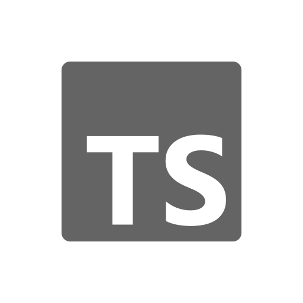

<div align="center">
  <p></p>
  <h1><code>EASYSHOP</code></h1>
</div>

<table>
  <tbody><tr><td align="center" width="99999"><div>
    <a href="https://olankens.com">WEBSITE</a> ·
    <a href="https://ko-fi.com/olankens">FUNDING</a>
  </div></td></tr></tbody>
  <tbody><tr><td align="center" width="99999">&nbsp;<div>
    Ecommerce backend in NestJS using Clean Architecture and DDD, rich aggregates, value objects, CQRS, domain events, sagas and ports and adapters across its four products, customers, orders and payments.
  </div>&nbsp;</td></tr></tbody>
  <tbody><tr><td align="center" width="99999">
    <a href="https://nestjs.com"></a>
    <picture></picture>
    <a href="https://postgresql.org"></a>
    <picture></picture>
    <a href="https://stripe.com"></a>
    <picture></picture>
    <a href="https://typescriptlang.org"></a>
  </td></tr></tbody>
</table>

## PREVIEWS

<table><tbody><tr><td width="99999">
  <picture></picture>
</td></tr></tbody></table>

## LEARNING

### LAUNCH WITH VSCODIUM

```sh
codium .
```